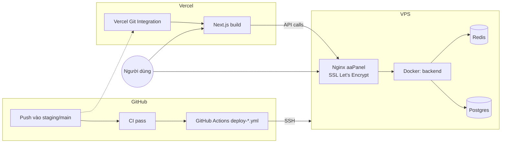

<div align="center">


# K-PLATFORM — HƯỚNG DẪN DEPLOY STAGING & PRODUCTION

</div>

> Tài liệu này hướng dẫn **từng bước, làm 1 lần** để dựng Staging + Production, và cách vận hành sau đó (chỉ cần `git push`). Đọc tuần tự từ trên xuống — các bước có phụ thuộc lẫn nhau.

**Kiến trúc đã chốt:**

| Thành phần                          | Nơi chạy                                                  | Cách deploy                               |
| ----------------------------------- | --------------------------------------------------------- | ----------------------------------------- |
| Frontend (Next.js)                  | Vercel                                                    | Vercel Git Integration (tự động khi push) |
| Backend (NestJS + Postgres + Redis) | Docker trên VPS có aaPanel (dùng chung VPS với site khác) | GitHub Actions → SSH → `docker compose`   |

| Môi trường | Nhánh Git | Frontend domain                    | Backend domain (qua Nginx aaPanel) |
| ---------- | --------- | ---------------------------------- | ---------------------------------- |
| Staging    | `staging` | `staging.kp.nhutnm.id.vn` (Vercel) | `api-staging.kp.nhutnm.id.vn`      |
| Production | `main`    | `prod.kp.nhutnm.id.vn` (Vercel)    | `api-prod.kp.nhutnm.id.vn`         |

> **Lưu ý về domain backend:** Vercel đã chiếm domain `staging.kp.nhutnm.id.vn`/`prod.kp.nhutnm.id.vn` cho frontend. Backend API cần một domain/subdomain **khác** trỏ vào VPS — tài liệu này dùng `api-staging.kp.nhutnm.id.vn`/`api-prod.kp.nhutnm.id.vn` làm ví dụ (tạo ở Bước 3.1). Đổi lại theo domain thật nếu bạn muốn đặt tên khác.



---

## Mục lục

- [Bước 1 — Chuẩn bị VPS (một lần)](#bước-1--chuẩn-bị-vps-một-lần)
- [Bước 2 — Dựng Backend bằng Docker trên VPS](#bước-2--dựng-backend-bằng-docker-trên-vps)
- [Bước 3 — Trỏ domain qua aaPanel + SSL](#bước-3--trỏ-domain-qua-aapanel--ssl)
- [Bước 4 — Deploy Frontend lên Vercel](#bước-4--deploy-frontend-lên-vercel)
- [Bước 5 — Cấu hình GitHub Environments & Secrets](#bước-5--cấu-hình-github-environments--secrets)
- [Bước 6 — Chạy thử deploy đầu tiên](#bước-6--chạy-thử-deploy-đầu-tiên)
- [Vận hành hằng ngày](#vận-hành-hằng-ngày)
- [Rollback](#rollback)
- [Troubleshooting](#troubleshooting)
- [Checklist bảo mật](#checklist-bảo-mật)

---

## Bước 1 — Chuẩn bị VPS (một lần)

### 1.1. Tạo user deploy riêng (không dùng root)

VPS đang chạy site khác qua aaPanel — không nên dùng user `root` cho GitHub Actions SSH vào. Tạo 1 user riêng, thêm vào group `docker`:

```bash
# SSH vào VPS bằng tài khoản quản trị hiện có
ssh root@<vps-ip>

adduser kplatform-deploy
usermod -aG docker kplatform-deploy   # nếu chưa cài Docker, xem 1.3 trước rồi quay lại dòng này
```

### 1.2. Tạo cặp SSH key riêng cho GitHub Actions

**Tạo trên máy local của bạn** (không tạo trên VPS, để private key không bao giờ rời khỏi máy bạn cho tới khi dán vào GitHub Secrets):

```bash
ssh-keygen -t ed25519 -C "github-actions-kplatform" -f ~/.ssh/kplatform_deploy_key
# Khi hỏi passphrase: để trống (Enter) — GitHub Actions không nhập passphrase được.
```

Lệnh trên tạo 2 file: `~/.ssh/kplatform_deploy_key` (private — sẽ dán vào GitHub Secret) và `~/.ssh/kplatform_deploy_key.pub` (public — cài lên VPS).

Cài public key lên VPS cho user `kplatform-deploy`:

```bash
ssh-copy-id -i ~/.ssh/kplatform_deploy_key.pub kplatform-deploy@<vps-ip>
# Nếu ssh-copy-id không có sẵn (Windows), nối tay vào:
#   cat ~/.ssh/kplatform_deploy_key.pub | ssh root@<vps-ip> "mkdir -p /home/kplatform-deploy/.ssh && cat >> /home/kplatform-deploy/.ssh/authorized_keys"
```

Kiểm tra đăng nhập được bằng key mới trước khi đi tiếp:

```bash
ssh -i ~/.ssh/kplatform_deploy_key kplatform-deploy@<vps-ip> "echo OK"
```

> Giữ nguyên nội dung file private key (`kplatform_deploy_key`) — cần dán **toàn bộ**, kể cả dòng `-----BEGIN ... KEY-----`/`-----END ... KEY-----`, vào GitHub Secret ở Bước 5.

### 1.3. Cài Docker (nếu VPS/aaPanel chưa có)

aaPanel có plugin "Docker管理器/Docker Manager" trong App Store — cài qua giao diện aaPanel là nhanh nhất. Hoặc cài thủ công:

```bash
curl -fsSL https://get.docker.com | sh
systemctl enable --now docker
docker compose version   # xác nhận có Compose v2 (lệnh `docker compose`, không phải `docker-compose`)
```

### 1.4. Tạo 2 thư mục deploy riêng biệt

```bash
sudo mkdir -p /www/wwwroot/kplatform-staging /www/wwwroot/kplatform-production
sudo chown -R kplatform-deploy:kplatform-deploy /www/wwwroot/kplatform-staging /www/wwwroot/kplatform-production
```

> Dùng `/www/wwwroot/...` để nhất quán với cấu trúc thư mục aaPanel hay dùng — bạn có thể đặt chỗ khác, miễn nhớ đúng path để điền `STAGING_DEPLOY_PATH`/`PRODUCTION_DEPLOY_PATH` ở Bước 5.

---

## Bước 2 — Dựng Backend bằng Docker trên VPS

Làm **thủ công 1 lần** để chắc chắn mọi thứ chạy được trước khi giao cho GitHub Actions tự động hoá.

### 2.1. Clone repo (lặp lại cho cả 2 thư mục, đổi nhánh tương ứng)

```bash
su - kplatform-deploy
cd /www/wwwroot/kplatform-staging
git clone -b staging https://github.com/nhockool1002/K-Platform.git .

cd /www/wwwroot/kplatform-production
git clone -b main https://github.com/nhockool1002/K-Platform.git .
```

> Nếu repo private, dùng Personal Access Token trong URL (`https://<token>@github.com/...`) hoặc deploy key riêng cho `git clone` — khác với SSH key ở Bước 1.2 (key đó dùng để GitHub Actions SSH **vào** VPS, không dùng để VPS git-clone **từ** GitHub).

### 2.2. Tạo file `.env` thật cho từng môi trường

```bash
cd /www/wwwroot/kplatform-staging
cp infra/.env.deploy.example .env
nano .env   # điền giá trị thật — xem bảng dưới
```

Giá trị cần điền khác nhau giữa 2 môi trường:

| Biến                   | Staging (gợi ý)                     | Production (gợi ý)             |
| ---------------------- | ----------------------------------- | ------------------------------ |
| `COMPOSE_PROJECT_NAME` | `kplatform-staging`                 | `kplatform-production`         |
| `POSTGRES_USER/DB`     | `kplatform_staging`                 | `kplatform_production`         |
| `POSTGRES_PASSWORD`    | sinh bằng `openssl rand -base64 24` | sinh **khác** staging          |
| `BACKEND_PORT`         | `4001`                              | `4002`                         |
| `FRONTEND_URL`         | `https://staging.kp.nhutnm.id.vn`   | `https://prod.kp.nhutnm.id.vn` |
| `JWT_ACCESS_SECRET`    | sinh bằng `openssl rand -base64 48` | sinh **khác** staging          |
| `JWT_REFRESH_SECRET`   | sinh bằng `openssl rand -base64 48` | sinh **khác** staging          |

Lặp lại cho `/www/wwwroot/kplatform-production/.env`.

### 2.3. Build & chạy lần đầu

```bash
cd /www/wwwroot/kplatform-staging
docker compose -f infra/docker-compose.deploy.yml --env-file .env up -d --build
docker compose -f infra/docker-compose.deploy.yml --env-file .env ps   # cả 3 service phải "healthy"/"running"
```

Chạy migration + (tuỳ chọn) seed dữ liệu demo:

```bash
docker compose -f infra/docker-compose.deploy.yml --env-file .env exec -T backend node_modules/.bin/prisma migrate deploy
docker compose -f infra/docker-compose.deploy.yml --env-file .env exec -T backend node_modules/.bin/prisma db seed
```

> Dùng thẳng `node_modules/.bin/prisma` thay vì `pnpm prisma:deploy`/`pnpm prisma:seed`: image production chỉ cài production dependencies (`pnpm deploy --prod`), package.json bên trong container vẫn liệt kê đủ devDependencies (eslint, vitest, ...) dù không cài — nếu gọi qua `pnpm run`, pnpm sẽ thấy "thiếu" so với package.json và tự tải lại toàn bộ (kể cả tải lại đúng phiên bản pnpm mới nhất qua corepack, có thể khác bản dùng lúc build), từng gây lỗi `ERR_PNPM_IGNORED_BUILDS`. Gọi thẳng binary đã có sẵn trong image thì không đụng tới pnpm/corepack chút nào.

> Đặt `SEED_DEV_PASSWORD` trong `.env` trước khi seed nếu muốn mật khẩu cố định cho các tài khoản demo (xem `infra/.env.deploy.example` và README.md § 10.2) — không set thì mỗi lần seed sinh mật khẩu ngẫu nhiên khác nhau, in ra console. Seed là dữ liệu demo cho giai đoạn pre-launch — xoá/đổi mật khẩu các tài khoản này trước khi mở Production cho người dùng thật.

Kiểm tra backend đã chạy đúng cổng loopback đã cấu hình:

```bash
curl http://127.0.0.1:4001/api/v1/health
# -> {"status":"ok","db":"up",...}
```

Lặp lại toàn bộ Bước 2.3 cho `/www/wwwroot/kplatform-production` (dùng cổng `4002`, `SEED_DEV_PASSWORD` khác staging).

---

## Bước 3 — Trỏ domain qua aaPanel + SSL

### 3.1. Trỏ DNS

Ở nhà cung cấp domain (`nhutnm.id.vn`), tạo 2 bản ghi A trỏ về IP của VPS:

```
api-staging.kp   A   <vps-ip>
api-prod.kp      A   <vps-ip>
```

(đổi tên nếu bạn chọn subdomain khác ở phần "Lưu ý về domain backend" đầu tài liệu)

### 3.2. Tạo site trong aaPanel

Trong aaPanel: **网站 (Website) → 添加站点 (Add site)**

- Domain: `api-staging.kp.nhutnm.id.vn`
- Không cần chọn PHP version / không cần tạo database ở bước này (chỉ dùng aaPanel làm reverse proxy + SSL, backend thật chạy trong Docker)

Lặp lại cho `api-prod.kp.nhutnm.id.vn`.

### 3.3. Bật Reverse Proxy

Vào site vừa tạo → tab **反向代理 (Reverse Proxy)** → Thêm proxy mới:

- Target URL: `http://127.0.0.1:4001` (staging) hoặc `http://127.0.0.1:4002` (production)
- Send Domain: giữ nguyên domain gốc (để backend nhận đúng `Host` header)

### 3.4. Bật SSL (Let's Encrypt miễn phí)

Vào site → tab **SSL** → chọn **Let's Encrypt** → Apply. aaPanel tự xin & gia hạn chứng chỉ. Bật luôn **Force HTTPS**.

### 3.5. Kiểm tra

```bash
curl https://api-staging.kp.nhutnm.id.vn/api/v1/health
curl https://api-prod.kp.nhutnm.id.vn/api/v1/health
```

Cả hai phải trả về `{"status":"ok",...}` qua HTTPS.

---

## Bước 4 — Deploy Frontend lên Vercel

Frontend deploy qua **Vercel Git Integration** — không cần GitHub Actions, không cần secret SSH nào cho phần này.

### 4.1. Import project

1. [vercel.com](https://vercel.com) → **Add New → Project** → chọn repo `nhockool1002/K-Platform`.
2. **Root Directory**: bấm Edit, chọn `frontend` (bắt buộc — đây là monorepo).
3. Framework Preset: Vercel tự nhận diện Next.js — giữ mặc định.
4. **Production Branch** (Settings → Git): đặt là `main`.

### 4.2. Biến môi trường

Settings → Environment Variables, thêm `NEXT_PUBLIC_API_URL`:

| Environment (Vercel) | Value                                        |
| -------------------- | -------------------------------------------- |
| Production           | `https://api-prod.kp.nhutnm.id.vn/api/v1`    |
| Preview              | `https://api-staging.kp.nhutnm.id.vn/api/v1` |

### 4.3. Gán domain theo nhánh Git

Settings → Domains:

1. Thêm `prod.kp.nhutnm.id.vn` → gán cho **Production** (mặc định, vì Production Branch = `main`).
2. Thêm `staging.kp.nhutnm.id.vn` → bấm **Edit** → chọn **"Assign to a Git Branch"** → chọn nhánh `staging`.

Từ giờ: push vào `main` → Vercel build & cập nhật `prod.kp.nhutnm.id.vn`. Push vào `staging` → Vercel build & cập nhật `staging.kp.nhutnm.id.vn`. Hoàn toàn tự động, không cần chạm vào GitHub Actions.

### 4.4. Cấu hình DNS cho domain Vercel

Vercel sẽ hiện bản ghi CNAME/A cần tạo cho `staging.kp.nhutnm.id.vn` và `prod.kp.nhutnm.id.vn` (thường là CNAME → `cname.vercel-dns.com`). Thêm bản ghi đó ở nhà cung cấp domain — khác với bước 3.1 (đó là domain backend, đây là domain frontend).

---

## Bước 5 — Cấu hình GitHub Environments & Secrets

### 5.1. Tạo 2 Environment

Repo → **Settings → Environments → New environment**:

- Tạo `staging`
- Tạo `production` → bấm vào, tick **Required reviewers**, thêm chính bạn làm reviewer. (Mục đích: mọi deploy production đều cần bạn bấm Approve thủ công trên GitHub trước khi workflow thật sự chạy — chặn deploy nhầm.)

### 5.2. Thêm Secrets cho từng Environment

Vào từng Environment vừa tạo → **Add secret**:

**Environment `staging`:**

| Secret name           | Giá trị                                                               |
| --------------------- | --------------------------------------------------------------------- |
| `STAGING_SSH_HOST`    | IP hoặc hostname của VPS                                              |
| `STAGING_SSH_PORT`    | Cổng SSH (bỏ qua nếu VPS dùng cổng mặc định 22)                       |
| `STAGING_SSH_USER`    | `kplatform-deploy`                                                    |
| `STAGING_SSH_KEY`     | **Toàn bộ nội dung** file `~/.ssh/kplatform_deploy_key` (private key) |
| `STAGING_DEPLOY_PATH` | `/www/wwwroot/kplatform-staging`                                      |

**Environment `production`:** tương tự, đổi prefix thành `PRODUCTION_` và path thành `/www/wwwroot/kplatform-production`.

> Dùng **chung 1 SSH key** cho cả 2 môi trường cũng được (đơn giản hơn) hoặc tạo 2 key riêng (an toàn hơn — lỡ lộ key staging không ảnh hưởng production). Nếu tạo riêng, lặp lại Bước 1.2 với tên file khác (`kplatform_deploy_key_prod`) và cài public key tương ứng.

### 5.3. (Khuyến nghị) Bật branch protection cho `staging` và `main`

Settings → Branches → Add rule — yêu cầu PR + status check `CI` pass trước khi merge vào `staging`/`main`. Việc này đảm bảo deploy workflow (chạy sau khi CI pass trên 2 nhánh này) không bao giờ nhận code chưa qua kiểm tra.

---

## Bước 6 — Chạy thử deploy đầu tiên

```bash
# Từ nhánh develop đã merge đầy đủ (hoặc nhánh feature đã merge vào develop):
git fetch origin develop staging
git checkout staging
git merge origin/develop
git push origin staging
```

Theo dõi tại GitHub → **Actions**:

1. Workflow **CI** chạy trước — phải xanh.
2. Workflow **Deploy Staging** tự kích hoạt sau khi CI xanh — xem log từng bước, đặc biệt bước **"Verify — health check qua domain công khai"**.

Nếu cả 2 xanh: mở `https://staging.kp.nhutnm.id.vn` (frontend, qua Vercel) và `https://api-staging.kp.nhutnm.id.vn/api/v1/health` (backend) — cả hai phải hoạt động.

Lặp lại tương tự cho `main` → `Deploy Production` khi staging đã test ổn.

---

## Vận hành hằng ngày

Sau khi setup xong Bước 1–5, quy trình hằng ngày chỉ còn:

```
feature/* → PR vào develop → merge
develop → PR vào staging → merge  →  CI chạy → Deploy Staging tự động (backend) + Vercel tự động (frontend)
staging → PR vào main → merge     →  CI chạy → chờ Approve → Deploy Production tự động (backend) + Vercel tự động (frontend)
```

Không cần SSH tay vào VPS nữa trừ khi troubleshoot hoặc đổi cấu hình `.env`.

---

## Rollback

**Frontend (Vercel):** Vercel dashboard → project → tab **Deployments** → chọn bản deploy cũ → **Promote to Production** (hoặc **Instant Rollback** nếu có). Không cần động vào Git.

**Backend (VPS):**

```bash
ssh kplatform-deploy@<vps-ip>
cd /www/wwwroot/kplatform-production   # hoặc -staging
git log --oneline -5                    # tìm commit muốn rollback về
git reset --hard <commit-sha-cũ>
docker compose -f infra/docker-compose.deploy.yml --env-file .env up -d --build
# Nếu migration của bản mới có thay đổi schema không tương thích ngược,
# cần xử lý thủ công (viết migration "down" hoặc khôi phục backup DB)
# trước khi reset code — rollback code không tự rollback schema DB.
```

> Luôn backup DB trước khi rollback nếu nghi ngờ có migration không tương thích: `docker compose -f infra/docker-compose.deploy.yml --env-file .env exec -T postgres pg_dump -U <user> <db> > backup-$(date +%F).sql`

---

## Troubleshooting

| Triệu chứng                                               | Nguyên nhân thường gặp                                                                    | Cách xử lý                                                                                      |
| --------------------------------------------------------- | ----------------------------------------------------------------------------------------- | ----------------------------------------------------------------------------------------------- |
| Workflow "Deploy" không chạy dù CI đã xanh                | `workflow_run` chỉ kích hoạt khi CI chạy trên đúng nhánh `staging`/`main` (không phải PR) | Đảm bảo bạn push/merge trực tiếp vào `staging`/`main`, không chỉ mở PR                          |
| Bước "Guard" báo thiếu secret                             | Chưa điền đủ secret trong đúng Environment                                                | Kiểm tra lại Bước 5.2 — tên secret phải khớp chính xác (phân biệt hoa/thường)                   |
| SSH action báo "Permission denied (publickey)"            | Public key chưa cài đúng user, hoặc dán sai private key vào Secret                        | `ssh -i <key> user@host` thử lại thủ công từ máy local trước                                    |
| Health check fail nhưng container "running"               | Migration lỗi, hoặc backend crash sau khi start                                           | `docker compose -f infra/docker-compose.deploy.yml --env-file .env logs backend --tail 100`     |
| 502 Bad Gateway từ aaPanel                                | Container backend chưa healthy khi Nginx proxy tới, hoặc sai `BACKEND_PORT`               | Kiểm tra `docker compose ps`, đối chiếu port trong `.env` với port trong cấu hình Reverse Proxy |
| Site khác trên VPS bị ảnh hưởng sau khi deploy K-Platform | Trùng port, hoặc Postgres/Redis publish nhầm ra host                                      | Đảm bảo dùng đúng `infra/docker-compose.deploy.yml` (không publish port Postgres/Redis)         |
| Vercel build fail "command not found" / sai thư mục       | Root Directory chưa set `frontend`                                                        | Settings → General → Root Directory → `frontend`, redeploy                                      |

---

## Checklist bảo mật

- [ ] Không dùng `root` cho SSH deploy — dùng user riêng (`kplatform-deploy`) trong group `docker`.
- [ ] Private key SSH chỉ tồn tại trên máy tạo key + trong GitHub Secret — không gửi qua chat/email.
- [ ] Postgres/Redis **không** publish port ra host (đã mặc định trong `infra/docker-compose.deploy.yml`).
- [ ] `JWT_ACCESS_SECRET`/`JWT_REFRESH_SECRET`/`POSTGRES_PASSWORD` khác nhau giữa staging và production.
- [ ] File `.env` trên VPS có quyền `600`, chỉ user deploy đọc được: `chmod 600 .env`.
- [ ] Environment `production` đã bật **Required reviewers**.
- [ ] Domain backend (`api-*.kp.nhutnm.id.vn`) bắt buộc HTTPS (Force SSL trong aaPanel).

---

<div align="center">
<sub>© 2026 K-Platform — Tài liệu vận hành nội bộ.</sub>
</div>
