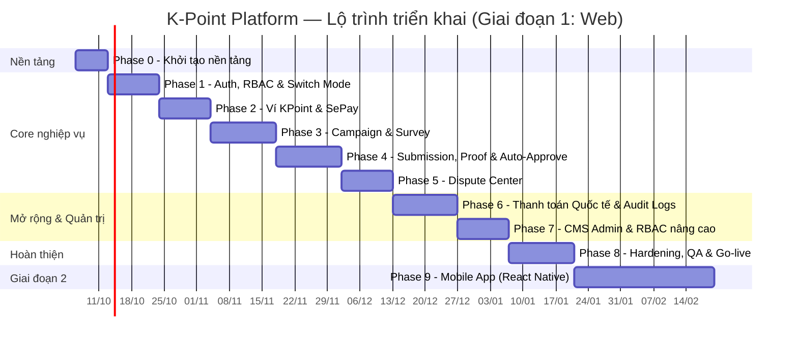

# K-POINT PLATFORM — KẾ HOẠCH TRIỂN KHAI DỰ ÁN

> Tài liệu này cụ thể hóa [README.md](README.md) / [SRS_K-PLATFORM-v1.0.docx](SRS_K-PLATFORM-v1.0.docx) thành kế hoạch thi công: các giai đoạn, sprint, đầu việc theo mã FN/SCR, tiêu chí nghiệm thu (DoD), rủi ro và nhân sự. Đây là bản nháp làm việc (living document) — cập nhật song song khi SRS được bổ sung.

---

## Mục lục

- [1. Mục tiêu & Phạm vi](#1-mục-tiêu--phạm-vi)
- [2. Giả định & Quyết định kiến trúc](#2-giả-định--quyết-định-kiến-trúc)
- [3. Tech Stack đề xuất](#3-tech-stack-đề-xuất)
- [4. Lộ trình tổng thể (Roadmap)](#4-lộ-trình-tổng-thể-roadmap)
- [5. Chi tiết theo Giai đoạn](#5-chi-tiết-theo-giai-đoạn)
  - [Phase 0 — Khởi tạo nền tảng](#phase-0--khởi-tạo-nền-tảng-1-tuần)
  - [Phase 1 — Auth, RBAC & Switch Mode](#phase-1--auth-rbac--switch-mode-15-tuần)
  - [Phase 2 — Ví KPoint & Thanh toán nội địa](#phase-2--ví-kpoint--thanh-toán-nội-địa-sepay-15-tuần)
  - [Phase 3 — Campaign & Survey](#phase-3--campaign--survey-2-tuần)
  - [Phase 4 — Submission, Proof & Auto-Approve](#phase-4--submission-proof--auto-approve-2-tuần)
  - [Phase 5 — Dispute Center](#phase-5--dispute-center-15-tuần)
  - [Phase 6 — Thanh toán Quốc tế (BMC) & Audit Logs](#phase-6--thanh-toán-quốc-tế-bmc--audit-logs-2-tuần)
  - [Phase 7 — CMS Admin & RBAC nâng cao](#phase-7--cms-admin--rbac-nâng-cao-15-tuần)
  - [Phase 8 — Hardening, QA & Go-live](#phase-8--hardening-qa--go-live-2-tuần)
  - [Phase 9 — Giai đoạn 2: Mobile App (React Native)](#phase-9--giai-đoạn-2-mobile-app-react-native-sau-go-live)
- [6. Ma trận FN/SCR → Module → Phase](#6-ma-trận-fnscr--module--phase)
- [7. Rủi ro & Giảm thiểu](#7-rủi-ro--giảm-thiểu)
- [8. Nhân sự & Vai trò](#8-nhân-sự--vai-trò)
- [9. Quy trình làm việc & Công cụ](#9-quy-trình-làm-việc--công-cụ)
- [10. Tiêu chí nghiệm thu tổng thể (Definition of Done)](#10-tiêu-chí-nghiệm-thu-tổng-thể-definition-of-done)
- [11. Việc còn mở / Cần quyết định thêm](#11-việc-còn-mở--cần-quyết-định-thêm)

---

## 1. Mục tiêu & Phạm vi

**Mục tiêu:** Xây dựng K-Point Platform — nền tảng kết nối Doanh nghiệp (Bên A) cần feedback/review thực tế với Người tiêu dùng (Bên B), vận hành bằng đơn vị tiền tệ nội bộ **KPoint**, có hệ thống phân quyền RBAC + Switch Mode, thanh toán nội địa tự động (SePay) và quốc tế bán tự động (Buy Me a Coffee), cùng CMS quản trị đầy đủ (Dispute, Audit Log, RBAC).

**Phạm vi Giai đoạn 1 (bản kế hoạch này):** 100% Web Responsive — toàn bộ 13 màn hình (SCR-01 → SCR-13), 13 chức năng (FN-*) và 11 API endpoint liệt kê trong SRS.

**Ngoài phạm vi Giai đoạn 1:** Ứng dụng di động React Native (đưa vào Phase 9, triển khai sau khi Web ổn định).

---

## 2. Giả định & Quyết định kiến trúc

SRS hiện là đặc tả nghiệp vụ (business/functional spec), chưa chốt công nghệ triển khai cụ thể. Kế hoạch này đưa ra **đề xuất** tech stack ở mục 3 dựa trên các ràng buộc đã nêu trong SRS (ACID transaction cho ví, webhook SePay, cronjob auto-approve, JWT, watermark ảnh/video, JSON diff cho audit log). Các giả định cần Product Owner xác nhận trước khi vào Phase 0:

| # | Giả định | Ảnh hưởng nếu sai |
|---|---|---|
| A1 | Dùng kiến trúc monolith modular (1 backend service) thay vì microservices ngay từ đầu, để tối ưu tốc độ ra MVP | Nếu cần tách service sớm (vd. do scale), cần refactor giữa Phase 6–7 |
| A2 | PostgreSQL là CSDL chính (phù hợp ACID transaction cho ví KPoint + quan hệ dữ liệu phức tạp ở ERD) | Đổi DB ảnh hưởng toàn bộ Phase 1–7 |
| A3 | Lưu trữ file (ảnh/video proof, receipt) dùng object storage (S3-compatible) chứ không lưu local disk | Ảnh hưởng FN-TASK-01, FN-PAY-02, hạ tầng triển khai |
| A4 | Webhook SePay & tích hợp Buy Me a Coffee dùng được ở môi trường sandbox/test trước go-live | Có thể trễ Phase 2 & Phase 6 nếu nhà cung cấp chưa cấp sandbox |
| A5 | Watermark ảnh/video (FN-TASK-01) xử lý server-side bất đồng bộ qua queue, không chặn request | Nếu xử lý đồng bộ, ảnh hưởng UX & cần resize timeout |

---

## 3. Tech Stack đề xuất

| Layer | Đề xuất | Lý do |
|---|---|---|
| Frontend Web | **Next.js (React) + TypeScript** + TailwindCSS | SSR cho SEO trang Public Campaign (SCR-01), Responsive nhanh, hệ sinh thái lớn |
| Backend API | **NestJS (Node.js/TypeScript)** | Kiến trúc module hóa rõ ràng (khớp theo FN-*), hỗ trợ tốt Guard/RBAC, Interceptor (khớp FN-LOG-01 Audit Log), Queue, Cron (FN-TASK-02) |
| Database | **PostgreSQL 15+** | ACID Transaction bắt buộc cho ví KPoint (FN-PAY-03, FN-DISP-03), quan hệ FK phức tạp đúng như ERD |
| Cache / Queue | **Redis** + BullMQ | Session/rate-limit, hàng đợi xử lý watermark, cronjob auto-approve 48h |
| Object Storage | **S3-compatible (AWS S3 / MinIO / Cloudflare R2)** | Lưu ảnh/video proof, receipt BMC, ảnh watermark |
| Auth | **JWT (access + refresh)**, OAuth2 Google/Facebook qua Passport.js | Đúng SCR-02, FN-AUTH-01 (switch mode không đổi JWT) |
| Thanh toán nội địa | **SePay API + Webhook** | Theo đặc tả FN-PAY-01 |
| Thanh toán quốc tế | **Buy Me a Coffee (thủ công, có màn hình đối soát CMS)** | Theo đặc tả FN-PAY-02/03 |
| Audit & Logging | **Interceptor NestJS ghi vào bảng `audit_logs`** + (tùy chọn) ELK/Prometheus-Grafana cho vận hành | Theo FN-LOG-01 |
| CI/CD | **GitHub Actions** → Docker image → Deploy (VPS/K8s tùy ngân sách) | Phù hợp repo đang host trên GitHub |
| Mobile (Phase 2) | **React Native (Expo)** | Theo đúng định hướng "mở rộng ứng dụng di động" nêu trong SRS mục I |

> Đây là đề xuất khởi điểm — có thể điều chỉnh theo năng lực đội ngũ hiện có. Điểm bắt buộc giữ nguyên: **CSDL hỗ trợ ACID transaction thật sự** (không dùng NoSQL thuần cho module Ví/Campaign/Dispute).

---

## 4. Lộ trình tổng thể (Roadmap)

**Tổng thời lượng Giai đoạn 1 (Phase 0–8): ~15 tuần (~3.5 tháng)** với 1 team full-stack trung bình (xem mục 8). Có thể rút ngắn ~20–30% nếu chạy song song Frontend/Backend trên từng phase thay vì tuần tự thuần túy.

---

## 5. Chi tiết theo Giai đoạn

Mỗi Phase liệt kê: **Đầu việc** (tham chiếu mã FN/SCR trong SRS) · **Đầu ra** · **Tiêu chí nghiệm thu (DoD)**.

### Phase 0 — Khởi tạo nền tảng (1 tuần)

**Đầu việc**
- [ ] Khởi tạo repo monorepo (frontend/, backend/, infra/), cấu hình TypeScript, ESLint/Prettier, Husky pre-commit
- [ ] Dựng CSDL PostgreSQL theo đúng ERD trong SRS Section VII (migration tool: Prisma/TypeORM)
- [ ] Thiết lập môi trường Dev/Staging (Docker Compose), biến môi trường (.env mẫu)
- [ ] CI pipeline cơ bản: lint + build + test trên mỗi PR
- [ ] Thiết kế hệ thống Design Token/UI Kit theo Branding (màu `#1d4e89` navy / `#e8a93a` gold, logo đính kèm)

**Đầu ra:** Repo chạy được "Hello World" end-to-end (FE gọi BE gọi DB), CI xanh.

**DoD:** Clone repo mới → `docker compose up` → truy cập FE + BE health-check `200 OK` không cần cấu hình thủ công thêm.

---

### Phase 1 — Auth, RBAC & Switch Mode (1.5 tuần)

**Đầu việc**
- [ ] SCR-02: Đăng ký/Đăng nhập Email+Password, quên mật khẩu
- [ ] SCR-02: OAuth2 Google/Facebook
- [ ] FN-AUTH-01: Switch Role Mode (đổi `active_mode`, giữ nguyên JWT — `POST /api/v1/auth/switch-mode`)
- [ ] Thiết lập bảng `users`, `roles_permissions`, Guard theo role (Bên A/Bên B/Super-Moderator/Administrator/Root Administrator)
- [ ] Ràng buộc bảo mật: Root Administrator hard-code ID, không thể bị xóa bởi bất kỳ API nào (test riêng cho rule này)
- [ ] SCR-03/SCR-06 (khung Dashboard rỗng, chưa có dữ liệu) để xác thực luồng Switch Mode trên UI

**Đầu ra:** Người dùng đăng ký → đăng nhập → bấm Switch Mode chuyển UI A ⇄ B mượt, không mất phiên.

**DoD:** Test case "đăng nhập bằng A, Switch sang B, gọi lại API bất kỳ" KHÔNG bị 401; thử xóa Root Administrator qua mọi endpoint đều bị chặn (403/409).

---

### Phase 2 — Ví KPoint & Thanh toán nội địa (SePay) (1.5 tuần)

**Đầu việc**
- [ ] Bảng `wallets` (balance_kpoint, reserved_kpoint) — tạo tự động khi user được tạo
- [ ] SCR-08: Màn hình Quản lý Ví & Nạp/Rút KPoint
- [ ] FN-PAY-01: Tạo QR VietQR nội dung `KPOINT <UserID>`, tích hợp Webhook `POST /api/v1/payments/sepay-webhook`
- [ ] Transaction ACID cho mọi thao tác cộng/trừ KPoint (dùng DB transaction + row lock, tuyệt đối không race-condition khi 2 request cùng lúc)
- [ ] Lập lệnh rút tiền về ngân hàng (UI + trạng thái PENDING, xử lý thủ công bởi Admin ở Phase 7)

**Đầu ra:** Nạp tiền thật qua SePay sandbox → KPoint cộng vào ví tức thời, hiển thị đúng trên Dashboard.

**DoD:** Test tải (concurrency test) 50 request cộng/trừ ví đồng thời không gây sai lệch số dư; webhook retry (SePay gọi lại do timeout) không bị cộng tiền 2 lần (idempotency theo `txn_id`).

---

### Phase 3 — Campaign & Survey (2 tuần)

**Đầu việc**
- [ ] SCR-04: Tạo Campaign & Survey Filter (cấu hình Slots, Price, Drip-feed, câu hỏi sàng lọc)
- [ ] FN-CAMP-01: `POST /api/v1/campaigns` — tính `Tổng KPoint = Phí tạo + (Slots × Price)`, khóa `reserved_kpoint`
- [ ] SCR-01: Trang chủ & Public Campaigns (danh sách, tìm kiếm, lọc theo nền tảng Google Maps/Facebook)
- [ ] SCR-05: Quản lý Campaign & Appliers (danh sách Bên B nộp Survey, Invite/Reject)
- [ ] FN-CAMP-02: Ứng tuyển Survey — kiểm tra Fingerprint/IP/Trust Score (chống multi-account)
- [ ] Quy tắc: Campaign cũ không thể xóa, chỉ Archive

**Đầu ra:** Bên A tạo được Campaign thật, Bên B tìm thấy và nộp Survey ứng tuyển, Bên A duyệt Invite/Reject.

**DoD:** Test "tạo Campaign khi không đủ số dư" bị chặn đúng thông báo; test Fingerprint/IP chặn được 1 user tạo 2 tài khoản ứng tuyển cùng Campaign.

---

### Phase 4 — Submission, Proof & Auto-Approve (2 tuần)

**Đầu việc**
- [ ] SCR-07: Làm Survey & Submit Proof (upload ảnh/video)
- [ ] FN-TASK-01: Nộp Proof & Watermark — xử lý bất đồng bộ (queue), chèn UserID + CampaignID lên file
- [ ] FN-TASK-02: Cronjob Auto-Approve 48h — quét `submissions` quá hạn `auto_approve_at`, tự động Approve + trả thưởng
- [ ] Giới hạn: Bên B chỉ nhận tối đa 1 slot/campaign
- [ ] Luồng duyệt/từ chối Proof từ phía Bên A (nối tiếp SCR-05)

**Đầu ra:** Vòng đời đầy đủ: ứng tuyển → review → nộp proof có watermark → Bên A duyệt hoặc hệ thống tự duyệt sau 48h → KPoint về ví Bên B.

**DoD:** Watermark xuất hiện đúng trên mọi file test (ảnh + video); cronjob chạy đúng giờ trên môi trường staging, verify bằng log; không trả thưởng trùng lặp nếu cronjob chạy nhiều lần.

---

### Phase 5 — Dispute Center (1.5 tuần)

**Đầu việc**
- [ ] FN-DISP-01: Tạo Dispute khi Bên A từ chối Proof — phong tỏa KPoint slot liên quan
- [ ] SCR-11: CMS Tranh chấp (Dispute Center) — Moderator xem bằng chứng 2 bên
- [ ] FN-DISP-02: Thẩm định Tranh chấp (Moderator) — chỉ chuyển `Pend Approval`/`Pend Reject`, không duyệt chi trực tiếp
- [ ] FN-DISP-03: Phán quyết Tranh chấp (Admin) — chốt cuối cùng, giải phóng KPoint đúng bên thắng

**Đầu ra:** Luồng tranh chấp đầy đủ 3 vai trò (Bên B tạo → Moderator đề xuất → Admin phán quyết).

**DoD:** Test toàn bộ 2 nhánh kết quả (thắng Bên A / thắng Bên B) đều giải phóng đúng số KPoint bị phong tỏa, không rò rỉ/nhân đôi điểm; Moderator không có quyền gọi trực tiếp API phán quyết cuối (kiểm tra RBAC).

---

### Phase 6 — Thanh toán Quốc tế (BMC) & Audit Logs (2 tuần)

**Đầu việc**
- [ ] FN-PAY-02: Form nạp Buy Me a Coffee — nhập Transaction ID + upload Receipt, trạng thái `PENDING_MANUAL_VERIFICATION`
- [ ] SCR-10: CMS Duyệt Nạp Tiền Quốc Tế — Admin đối soát, Approve/Reject
- [ ] FN-PAY-03: Approve → ACID Transaction cộng KPoint + email + Audit Log; Reject → thông báo hủy
- [ ] FN-LOG-01: Interceptor ghi Audit Log cho mọi Mutation (CREATE/UPDATE/DELETE/DISPUTE_RESOLVE/MANUAL_TOPUP) — JSON Diff trước/sau, IP, Device Fingerprint
- [ ] SCR-13: CMS Quản lý Audit Logs — bộ lọc, bảng hiển thị, Log Detail (JSON viewer), cảnh báo CRITICAL (đổi màu đỏ)

**Đầu ra:** Admin duyệt nạp tiền quốc tế thủ công đầy đủ; mọi thao tác nhạy cảm đều truy vết được qua Audit Log.

**DoD:** 100% hành động trong danh sách CRITICAL (hạ cấp Admin, sửa số dư thủ công, duyệt dispute giá trị lớn, đăng nhập IP lạ) đều xuất hiện trong Audit Log đúng định dạng; không có đường tắt (backdoor endpoint) bỏ qua ghi log.

---

### Phase 7 — CMS Admin & RBAC nâng cao (1.5 tuần)

**Đầu việc**
- [ ] SCR-09: CMS Overview & Thống kê (KPoint lưu thông, lượt review/ngày, doanh thu phí khởi tạo)
- [ ] SCR-12: CMS Quản lý RBAC & Root Admin — tạo role, gán permission, gán Admin/Mod, phân công Campaign cho Mod
- [ ] Xử lý lệnh rút tiền về ngân hàng (hoàn thiện nốt phần Admin duyệt từ Phase 2)
- [ ] Hoàn thiện toàn bộ ràng buộc RBAC còn lại theo bảng Section II của SRS

**Đầu ra:** Admin/Root Admin vận hành toàn bộ hệ thống qua CMS mà không cần can thiệp DB trực tiếp.

**DoD:** Root Administrator có thể tạo/xóa Admin khác và chính sách phân quyền được Audit Log ghi lại đầy đủ (liên kết Phase 6).

---

### Phase 8 — Hardening, QA & Go-live (2 tuần)

**Đầu việc**
- [ ] Kiểm thử bảo mật cơ bản: OWASP Top 10 (injection, IDOR giữa các role, rate-limit auth)
- [ ] Kiểm thử tải cho các luồng tài chính (nạp/rút/dispute) — mục tiêu p95 < 500ms ở tải dự kiến
- [ ] Viết tài liệu vận hành (runbook): xử lý webhook lỗi, cronjob fail, rollback migration
- [ ] UAT (User Acceptance Test) với checklist bám theo từng SCR/FN trong SRS
- [ ] Thiết lập monitoring/alerting (uptime, lỗi 5xx, queue backlog, cronjob miss)
- [ ] Soạn kịch bản go-live + rollback plan

**Đầu ra:** Hệ thống sẵn sàng vận hành thật, có người trực giám sát 48h đầu sau go-live.

**DoD:** Toàn bộ checklist UAT pass; không còn lỗi mức Critical/High mở; có runbook + on-call xác nhận.

---

### Phase 9 — Giai đoạn 2: Mobile App (React Native) (sau Go-live)

> Theo đúng định hướng "mở rộng ứng dụng di động (React Native) trong giai đoạn tiếp theo" nêu tại SRS Section I. Lên kế hoạch chi tiết (sprint-by-sprint) sau khi Web Phase 1 ổn định ≥ 4 tuần.

**Đầu việc (sơ bộ)**
- [ ] Thiết kế lại UI/UX cho mobile (tái sử dụng API backend hiện có, không đổi hợp đồng API nếu có thể)
- [ ] Đăng nhập sinh trắc học / push notification cho Invite, Duyệt Proof, Kết quả Dispute
- [ ] Upload ảnh/video Proof tối ưu cho mobile (nén trước khi upload)
- [ ] Phát hành thử nghiệm nội bộ (TestFlight / Internal Testing track)

---

## 6. Ma trận FN/SCR → Module → Phase

| Mã | Tên | Module | Phase |
|---|---|---|---|
| FN-AUTH-01 | Switch Role Mode | Auth | 1 |
| FN-PAY-01 | Nạp SePay Tự động | Wallet | 2 |
| FN-PAY-02 | Nạp BuyMeACoffee | Wallet | 6 |
| FN-PAY-03 | Duyệt Nạp Quốc tế | Wallet/CMS | 6 |
| FN-CAMP-01 | Khởi tạo Campaign | Campaign | 3 |
| FN-CAMP-02 | Ứng tuyển Survey | Campaign | 3 |
| FN-TASK-01 | Nộp Proof & Watermark | Submission | 4 |
| FN-TASK-02 | Auto-Approve 48h | Submission | 4 |
| FN-DISP-01 | Tạo Khiếu nại | Dispute | 5 |
| FN-DISP-02 | Thẩm định Tranh chấp | Dispute | 5 |
| FN-DISP-03 | Phán quyết Tranh chấp | Dispute | 5 |
| FN-LOG-01 | Ghi Audit Logs | Audit | 6 |
| SCR-01 | Trang chủ & Public Campaigns | Public | 3 |
| SCR-02 | Đăng ký/Đăng nhập/OAuth | Auth | 1 |
| SCR-03 | Dashboard Bên A | Campaign | 1 (khung) / 3 (dữ liệu) |
| SCR-04 | Tạo Campaign & Survey Filter | Campaign | 3 |
| SCR-05 | Quản lý Campaign & Appliers | Campaign | 3 / 4 |
| SCR-06 | Dashboard Bên B | Submission | 1 (khung) / 4 (dữ liệu) |
| SCR-07 | Làm Survey & Submit Proof | Submission | 4 |
| SCR-08 | Quản lý Ví & Nạp/Rút | Wallet | 2 |
| SCR-09 | CMS Overview & Thống kê | CMS | 7 |
| SCR-10 | CMS Duyệt Nạp Tiền Quốc Tế | CMS | 6 |
| SCR-11 | CMS Tranh chấp | CMS | 5 |
| SCR-12 | CMS Quản lý RBAC & Root Admin | CMS | 7 |
| SCR-13 | CMS Quản lý Audit Logs | CMS | 6 |

---

## 7. Rủi ro & Giảm thiểu

| # | Rủi ro | Mức độ | Giảm thiểu |
|---|---|---|---|
| R1 | Webhook SePay không có sandbox sớm → chặn Phase 2 | Cao | Làm việc với SePay ngay từ Phase 0 để xin sandbox; song song mock webhook nội bộ để không block dev |
| R2 | Race-condition trên Ví KPoint khi nhiều giao dịch đồng thời | Cao | Bắt buộc DB transaction + row-level lock (`SELECT ... FOR UPDATE`) cho mọi thao tác ví, viết test concurrency từ Phase 2 |
| R3 | Buy Me a Coffee không có API đối soát tự động → Admin đối soát thủ công có thể sai sót | Trung bình | Thiết kế SCR-10 hiển thị rõ ràng Transaction ID + Receipt side-by-side, log lại người duyệt (`verified_by`) để truy vết |
| R4 | Watermark xử lý chậm ảnh hưởng UX khi upload video lớn | Trung bình | Xử lý bất đồng bộ qua queue (Phase 4), hiển thị trạng thái "đang xử lý" trên UI |
| R5 | Lạm dụng multi-account để nhận nhiều slot Campaign | Trung bình | FN-CAMP-02 kiểm tra Fingerprint/IP/Trust Score — cần đầu tư kỹ ngay từ Phase 3, không để tới cuối dự án |
| R6 | Phạm vi Audit Log quá rộng gây quá tải DB | Thấp | Đánh index đúng (actor_id, action_type, created_at), cân nhắc archive log cũ sang cold storage sau 6–12 tháng |
| R7 | SRS còn thiếu chi tiết UI/UX, wireframe | Trung bình | Cần thiết kế UI/UX song song Phase 0–1 (không nằm trong phạm vi SRS hiện tại) — xem mục 11 |

---

## 8. Nhân sự & Vai trò

| Vai trò | Số lượng đề xuất | Trách nhiệm chính |
|---|---|---|
| Product Owner / BA | 1 | Chốt yêu cầu, ưu tiên hóa backlog, duyệt UAT |
| Tech Lead / Solution Architect | 1 | Quyết định kiến trúc (mục 2–3), review code, đảm bảo ACID cho ví |
| Backend Engineer | 2 | NestJS modules theo FN-*, tích hợp SePay/BMC, cronjob, audit interceptor |
| Frontend Engineer | 2 | Next.js UI theo SCR-*, responsive, tích hợp API |
| QA Engineer | 1 | Viết test case theo DoD từng Phase, UAT, kiểm thử bảo mật cơ bản |
| DevOps (bán thời gian) | 1 | CI/CD, hạ tầng Docker/K8s, monitoring |
| UI/UX Designer (bán thời gian) | 1 | Thiết kế UI chi tiết dựa trên Branding (xem mục 11) |

---

## 9. Quy trình làm việc & Công cụ

- **Git flow:** `main` (production) ← `develop` ← nhánh `feature/<phase>-<mô-tả>`; mỗi PR phải pass CI + 1 reviewer trước khi merge vào `develop`.
- **Quản lý task:** Mỗi đầu việc ở mục 5 tương ứng 1 issue/ticket, gắn nhãn theo Phase và mã FN/SCR để truy vết lại SRS.
- **Sprint:** 1 sprint = 1 tuần làm việc (phù hợp các Phase 1–1.5–2 tuần ở trên = 1–2 sprint/phase).
- **Definition of Ready (trước khi vào sprint):** Ticket có mô tả, tham chiếu FN/SCR, tiêu chí chấp nhận rõ ràng, không phụ thuộc chưa giải quyết.
- **Review cuối mỗi Phase:** Demo trực tiếp cho Product Owner, đối chiếu DoD của Phase đó trước khi sang Phase kế tiếp.

---

## 10. Tiêu chí nghiệm thu tổng thể (Definition of Done)

Dự án Giai đoạn 1 được coi là **hoàn thành** khi:

1. Toàn bộ 13 màn hình (SCR-01 → SCR-13) hoạt động đúng mô tả trong SRS, responsive trên desktop + mobile web.
2. Toàn bộ 13 chức năng (FN-*) pass test case tương ứng ở mục 5.
3. Toàn bộ 11 API endpoint trả đúng payload như SRS Section VI, có test tự động (unit + integration).
4. Không còn lỗi mức Critical/High mở trong tracker.
5. Audit Log ghi nhận đầy đủ, không có thao tác tài chính nào "vô hình" (không truy vết được).
6. UAT được Product Owner ký duyệt.
7. Có runbook vận hành và kế hoạch rollback.

---

## 11. Việc còn mở / Cần quyết định thêm

- [ ] **Wireframe/UI chi tiết:** SRS mô tả chức năng màn hình nhưng chưa có thiết kế UI cụ thể — cần Figma trước khi Frontend bắt tay vào Phase 1.
- [ ] **Chính sách phí rút tiền / tỷ giá KPoint↔VNĐ↔USD biến động:** SRS nêu tỷ giá "có thể điều chỉnh linh hoạt" nhưng chưa có quy tắc version hóa tỷ giá theo thời gian — cần chốt trước Phase 2 & 6.
- [ ] **SLA xử lý Dispute & Duyệt nạp Quốc tế:** chưa có cam kết thời gian xử lý (vd. Admin phải duyệt trong X giờ) — nên bổ sung vào SRS.
- [ ] **Chính sách chống gian lận chi tiết** (ngoài Fingerprint/IP/Trust Score): ngưỡng Trust Score cụ thể, quy tắc khóa tài khoản.
- [ ] **Phiên bản SRS kế tiếp:** Tài liệu SRS hiện tại (README/DOCX) sẽ còn được bổ sung theo bạn đã đề cập — kế hoạch này cần đối chiếu lại mục 6 (ma trận FN/SCR) mỗi khi SRS cập nhật.

---

© 2026 K-Point Platform — Tài liệu kế hoạch nội bộ, cập nhật song song với SRS.

