

# K-POINT PLATFORM
### Nền tảng Kết nối Khảo sát & Trải nghiệm Thực tế

**TÀI LIỆU ĐẶC TẢ YÊU CẦU PHẦN MỀM (SRS)**

---

## Mục lục

- [Thông tin tài liệu & Lịch sử phiên bản](#thông-tin-tài-liệu--lịch-sử-phiên-bản)
- [I. Tổng quan nền tảng & Mô hình tài chính](#i-tổng-quan-nền-tảng--mô-hình-tài-chính)
- [II. Hệ thống phân quyền (RBAC & Switch Mode)](#ii-hệ-thống-phân-quyền-rbac--switch-mode)
- [III. Đặc tả tính năng mở rộng: Thanh toán quốc tế & Audit Logs](#iii-đặc-tả-tính-năng-mở-rộng-thanh-toán-quốc-tế--audit-logs)
- [IV. Danh sách màn hình (Screen List)](#iv-danh-sách-màn-hình-screen-list)
- [V. Danh sách chức năng (Function List)](#v-danh-sách-chức-năng-function-list)
- [VI. Danh sách API Endpoints (API List)](#vi-danh-sách-api-endpoints-api-list)
- [VII. Thiết kế cơ sở dữ liệu cốt lõi (Database Schema)](#vii-thiết-kế-cơ-sở-dữ-liệu-cốt-lõi-database-schema)
- [VIII. User Flows (Luồng nghiệp vụ người dùng)](#viii-user-flows-luồng-nghiệp-vụ-người-dùng)
  - [8.1. Luồng Bên A — Advertiser](#81-luồng-bên-a--advertiser)
  - [8.2. Luồng Bên B — Publisher](#82-luồng-bên-b--publisher)
  - [8.3. Luồng Nạp KPoint (SePay & Buy Me a Coffee)](#83-luồng-nạp-kpoint-sepay--buy-me-a-coffee)
  - [8.4. Luồng Xử lý Khiếu nại (Dispute)](#84-luồng-xử-lý-khiếu-nại-dispute)
- [IX. Sequence Diagrams (Luồng xử lý kỹ thuật)](#ix-sequence-diagrams-luồng-xử-lý-kỹ-thuật)
  - [9.1. Switch Role Mode](#91-switch-role-mode)
  - [9.2. Nạp SePay tự động](#92-nạp-sepay-tự-động)
  - [9.3. Nạp & Duyệt Buy Me a Coffee](#93-nạp--duyệt-buy-me-a-coffee)
  - [9.4. Khởi tạo Campaign](#94-khởi-tạo-campaign)
  - [9.5. Nộp Proof & Auto-Approve 48h](#95-nộp-proof--auto-approve-48h)
  - [9.6. Vòng đời Dispute](#96-vòng-đời-dispute)

---

## Thông tin tài liệu & Lịch sử phiên bản

| Dữ liệu | Thông tin chi tiết |
|---|---|
| Tên dự án | Nền tảng KPoint Platform (Web/App Cross-Platform) |
| Nội dung gốc tham chiếu | SRS v2.0 (Official Specification) |
| Phiên bản tài liệu (Edition) | **v1.0** — Bản chuẩn hóa, bổ sung Branding, Mục lục, User Flow & Sequence Diagram |
| Ngày cập nhật | Tháng 10 / 2026 |
| Tác giả | Chuyên viên Phân tích Hệ thống (System Analyst) |
| Trạng thái | Đã phê duyệt kiến trúc & Sẵn sàng bàn giao Dev |

| Phiên bản | Ngày | Mô tả thay đổi |
|---|---|---|
| SRS v2.0 | Tháng 10 / 2026 | Bản đặc tả gốc: Tổng quan, RBAC, Thanh toán quốc tế, Audit Logs, Screen/Function/API List, Database Schema. |
| **Document Edition v1.0** | Tháng 10 / 2026 | Chuẩn hóa định dạng theo khung SRS chuẩn, thêm Branding header, Mục lục liên kết, **User Flow** (4 luồng) và **Sequence Diagram** (6 luồng kỹ thuật) minh họa chi tiết các chức năng đã đặc tả. |

---

## I. Tổng quan nền tảng & Mô hình tài chính

Nền tảng KPoint là ứng dụng kết nối trung gian giữa **Doanh nghiệp/Cá nhân có nhu cầu gia tăng feedback/review thực tế (Bên A)** và **Người tiêu dùng trải nghiệm sản phẩm/dịch vụ (Bên B)**. Hệ thống ưu tiên phát triển 100% Web Responsive trong giai đoạn 1, đồng thời mở rộng ứng dụng di động (React Native) trong giai đoạn tiếp theo.

### 1. Đơn vị tiền tệ nội bộ

- Sử dụng đơn vị tiền tệ duy nhất: **KPoint** (Tỷ lệ quy đổi tiêu chuẩn: `1 KPoint = 1 VNĐ`, có thể điều chỉnh tỷ giá linh hoạt trong CMS Admin).
- Phí khởi tạo Campaign: `50.000 – 100.000 KPoint` (Cấu hình bởi Admin).

### 2. Mô hình & Phương thức Thanh toán

- **Thanh toán Nội địa (Tự động 24/7):** Tích hợp cổng SePay qua mã QR chuyển khoản ngân hàng. Webhook SePay gạch nợ tự động và cộng KPoint vào Ví ngay lập tức.
- **Thanh toán Quốc tế (Duyệt thủ công):** Tích hợp luồng nạp điểm qua Buy Me a Coffee. Doanh nghiệp thực hiện thanh toán USD qua Buy Me a Coffee, nhập mã giao dịch (Transaction ID) và tải ảnh Hóa đơn/Receipt lên hệ thống. Đội ngũ Quản trị viên (Party C) kiểm tra, đối soát và phê duyệt cộng KPoint thủ công.

---

## II. Hệ thống phân quyền (RBAC & Switch Mode)

Hệ thống áp dụng **Phân quyền dựa trên Vai trò (Role-Based Access Control)**. Cả Bên A và Bên B có thể dùng chung 1 tài khoản và sử dụng tính năng **Switch Mode** linh hoạt.

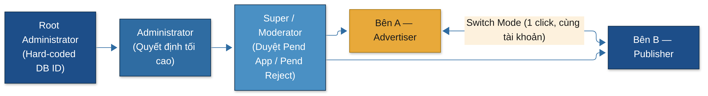

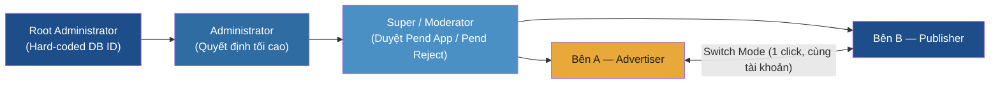

| Role / Nhóm | Quyền hạn & Phạm vi Thao tác | Ràng buộc & Quy tắc Bảo mật |
|---|---|---|
| Bên A (Advertiser) | Tạo Campaign, nạp KPoint, thiết lập Survey màng lọc, duyệt/từ chối Proof của Bên B. | Không có quyền xóa Campaign cũ (chỉ Archive). Tiền tạm khóa ngay khi Active. |
| Bên B (Publisher) | Làm Survey ứng tuyển, thực hiện Review, nộp Proof (ảnh/video), rút KPoint, Khiếu nại (Dispute). | Chỉ nhận tối đa 1 slot/campaign. Ảnh proof tự động bị chèn Watermark định danh. |
| Switch Mode | Chuyển đổi qua lại giữa giao diện Bên A và Bên B chỉ với 1 thao tác bấm nút. | Ví KPoint dùng chung. Lịch sử giao dịch tách biệt theo chế độ. |
| Root Administrator | Toàn quyền hệ thống. Phân quyền, nâng/hạ cấp các Admin khác, can thiệp mọi tài nguyên. | Hard-code ID trong DB, không thể bị xóa khỏi hệ thống bởi bất kỳ API nào. |
| Administrator | Cấu hình hệ thống, phê duyệt thanh toán Buy Me a Coffee, chốt phán quyết khiếu nại (Dispute). | Quyết định cuối cùng trong việc cộng/trừ KPoint tranh chấp. |
| Super / Moderator | Quản lý Campaign được phân công, thẩm định các ca khiếu nại (Dispute). | Chỉ được chuyển trạng thái sang `Pend Approval` / `Pend Reject`. Không trực tiếp duyệt chi. |

---

## III. Đặc tả tính năng mở rộng: Thanh toán quốc tế & Audit Logs

### 1. Quy trình Thanh toán Quốc tế via Buy Me a Coffee (Duyệt thủ công)

1. **Khởi tạo:** Bên A truy cập trang Nạp KPoint → Chọn phương thức Buy Me a Coffee (International).
2. **Hướng dẫn & Nhập liệu:** Hệ thống hiển thị liên kết Buy Me a Coffee của nền tảng + Tỷ giá quy đổi USD/KPoint. Bên A thực hiện thanh toán trên Buy Me a Coffee, tải ảnh Hóa đơn/Receipt và nhập `Transaction ID` vào Form.
3. **Chờ xác nhận:** Yêu cầu nạp tiền chuyển sang trạng thái `PENDING_MANUAL_VERIFICATION`.
4. **Đối soát CMS:** Admin nhận thông báo, mở màn hình CMS Duyệt Thanh toán Quốc tế, đối soát biến động trên tài khoản Buy Me a Coffee thực tế.
5. **Thực thi:**
   - **Approve:** Admin bấm Phê duyệt → Hệ thống thực hiện ACID Transaction cộng KPoint vào ví Bên A, gửi email thông báo và ghi Audit Log.
   - **Reject:** Admin bấm Từ chối kèm lý do → Hệ thống gửi thông báo hủy giao dịch cho Bên A.

> Xem chi tiết kỹ thuật tại [Sequence Diagram 9.3 — Nạp & Duyệt Buy Me a Coffee](#93-nạp--duyệt-buy-me-a-coffee).

### 2. Màn hình Quản lý Audit Logs (Nhật ký Hệ thống)

Nhật ký Audit Logs ghi lại toàn bộ các thao tác nhạy cảm của Quản trị viên, Moderator và biến động tài chính của người dùng nhằm phục vụ công tác truy vết và bảo mật.

| Thành phần Màn hình | Đặc tả Chi tiết & Chức năng |
|---|---|
| Bộ lọc Tra cứu (Filters) | Lọc theo Khoảng thời gian, User ID / Email, Role, Loại hành động (`CREATE`, `UPDATE`, `DELETE`, `DISPUTE_RESOLVE`, `MANUAL_TOPUP`), Mức độ cảnh báo (`INFO`, `WARNING`, `CRITICAL`). |
| Bảng hiển thị Nhật ký | Hiển thị Timestamp, Actor (Người thực hiện), Target Resource (Tài nguyên bị tác động), Action Type, IP Address, Device Fingerprint, Old Value vs New Value (JSON Diff). |
| Màn hình Chi tiết (Log Detail) | Pop-up xem toàn bộ payload JSON request/response, địa chỉ IP, User-Agent, và dữ liệu so sánh chi tiết trước/sau khi thay đổi. |
| Cảnh báo Bất thường | Đánh dấu màu đỏ đối với các hành vi `CRITICAL`: Hạ cấp Admin, Thay đổi số dư thủ công, Duyệt khiếu nại giá trị lớn, Đăng nhập từ IP lạ. |

---

## IV. Danh sách màn hình (Screen List)

| Mã MH | Tên Màn hình | Phân vùng | Mô tả Chức năng Màn hình |
|---|---|---|---|
| SCR-01 | Trang chủ & Public Campaigns | End-User | Hiển thị danh sách chiến dịch nổi bật, thanh tìm kiếm, bộ lọc nền tảng (Google Maps / Facebook). |
| SCR-02 | Đăng ký / Đăng nhập / OAuth | End-User | Đăng nhập email/pass, Google/Facebook OAuth2, quên mật khẩu. |
| SCR-03 | Dashboard Bên A (Advertiser) | Bên A | Thống kê Campaign, tổng KPoint đã chi, lượt review hoàn thành, lối tắt tạo camp. |
| SCR-04 | Tạo Campaign & Survey Filter | Bên A | Form cấu hình yêu cầu review, cài đặt Drip-feed, tạo câu hỏi Survey sàng lọc Bên B. |
| SCR-05 | Quản lý Campaign & Appliers | Bên A | Xem danh sách Bên B nộp Survey, bấm Invite/Reject, duyệt Proof bài viết. |
| SCR-06 | Dashboard Bên B (Publisher) | Bên B | Thống kê KPoint kiếm được, nhiệm vụ đang làm, số dư ví khả dụng. |
| SCR-07 | Làm Survey & Submit Proof | Bên B | Form trả lời survey ứng tuyển, form tải lên hình ảnh/video bằng chứng review. |
| SCR-08 | Quản lý Ví & Nạp/Rút KPoint | End-User | Nạp SePay QR, Nạp Buy Me a Coffee (upload receipt), lập lệnh rút tiền về ngân hàng. |
| SCR-09 | CMS Overview & Thống kê | Admin/Mod | Tổng quan KPoint lưu thông, số lượt review/ngày, doanh thu phí khởi tạo. |
| SCR-10 | CMS Duyệt Nạp Tiền Quốc Tế | Admin | Danh sách giao dịch Buy Me a Coffee chờ duyệt, xem file đính kèm receipt, Approve/Reject. |
| SCR-11 | CMS Tranh chấp (Dispute Center) | Mod/Admin | Xem chứng cứ 2 bên, Moderator chọn Pend App/Reject, Admin duyệt phán quyết. |
| SCR-12 | CMS Quản lý RBAC & Root Admin | Root/Admin | Tạo role, gán permission, gán quyền Admin/Mod, phân công Campaign cho Mod. |
| SCR-13 | CMS Quản lý Audit Logs | Admin/Root | Màn hình tra cứu nhật ký thao tác toàn hệ thống, bộ lọc nâng cao, JSON viewer. |

---

## V. Danh sách chức năng (Function List)

| Mã FN | Tên Chức năng | Actor | Mô tả Chi tiết Luồng Xử lý Kỹ thuật |
|---|---|---|---|
| FN-AUTH-01 | Switch Role Mode | Bên A / B | Chuyển đổi context làm việc giữa Advertiser và Publisher mà không thay đổi Session JWT. |
| FN-PAY-01 | Nạp SePay Tự động | Bên A | Tạo mã QR VietQR kèm nội dung `KPOINT <UserID>`. Webhook SePay gọi API tự động cộng điểm. |
| FN-PAY-02 | Nạp BuyMeACoffee | Bên A | Lưu Form thông tin thanh toán quốc tế + ảnh receipt. Đẩy trạng thái `PENDING_VERIFY` cho Admin. |
| FN-PAY-03 | Duyệt Nạp Quốc tế | Admin | Admin xem ảnh receipt, bấm Duyệt → Hệ thống gọi Transaction ACID cộng balance KPoint. |
| FN-CAMP-01 | Khởi tạo Campaign | Bên A | Tính `Tổng KPoint = Phí tạo + (Slots × Price)`. Khóa số dư trong Wallet, lưu cấu hình Drip-feed. |
| FN-CAMP-02 | Ứng tuyển Survey | Bên B | Kiểm tra Fingerprint, IP, Trust Score. Lưu câu trả lời survey + ảnh hóa đơn trải nghiệm. |
| FN-TASK-01 | Nộp Proof & Watermark | Bên B | Tải lên ảnh/video review. Backend tự động đóng dấu chèn mã UserID + CampaignID lên file. |
| FN-TASK-02 | Auto-Approve 48h | System | Cronjob chạy định kỳ kiểm tra task quá 48h chưa duyệt → Tự động Approve và trả thưởng. |
| FN-DISP-01 | Tạo Khiếu nại (Dispute) | Bên B | Kích hoạt khi Bên A từ chối. Phong tỏa tiền slot, tạo Ticket tranh chấp chuyển cho Moderator. |
| FN-DISP-02 | Thẩm định Tranh chấp | Moderator | Xem bằng chứng 2 bên, chọn `Pend Approval` hoặc `Pend Reject`. Gửi thông báo cho Admin. |
| FN-DISP-03 | Phán quyết Tranh chấp | Admin | Chốt phán quyết cuối cùng. Giải phóng KPoint bị phong tỏa về Ví của Bên A hoặc Bên B. |
| FN-LOG-01 | Ghi Audit Logs | System | Interceptor bắt các sự kiện Mutation (POST/PUT/DELETE/DISPUTE), lưu chi tiết JSON Diff và IP. |

---

## VI. Danh sách API Endpoints (API List)

| Method | Endpoint URL | Auth / Role | Input / Body Payload | Output / Response Payload |
|---|---|---|---|---|
| POST | `/api/v1/auth/switch-mode` | JWT (User) | `{ "targetRole": "A" \| "B" }` | `{ "success": true, "activeRole": "A" }` |
| POST | `/api/v1/payments/sepay-webhook` | API Key | SePay Webhook Payload | `{ "status": 200, "credited": true }` |
| POST | `/api/v1/payments/bmc-topup` | JWT (Bên A) | `{ "amountUsd": 50, "txnId": "BMC123", "receiptUrl": "..." }` | `{ "topupId": "TP-99", "status": "PENDING" }` |
| POST | `/api/v1/admin/payments/bmc/:id/approve` | JWT (Admin) | `{ "note": "Đã đối soát ví BMC" }` | `{ "success": true, "newBalance": 1250000 }` |
| POST | `/api/v1/campaigns` | JWT (Bên A) | Campaign JSON config & Survey | `{ "campaignId": "CP-101", "reservedPoints": 550000 }` |
| POST | `/api/v1/campaigns/:id/apply` | JWT (Bên B) | `{ "surveyAnswers": [...], "billProofUrl": "..." }` | `{ "applicationId": "AP-88", "status": "PENDING" }` |
| POST | `/api/v1/submissions/:id/proof` | JWT (Bên B) | Multipart: image/video | `{ "proofId": "PR-55", "watermarkedUrl": "..." }` |
| POST | `/api/v1/disputes` | JWT (Bên B) | `{ "submissionId": "PR-55", "reason": "Duyệt sai" }` | `{ "disputeId": "DSP-12", "status": "OPEN" }` |
| PUT | `/api/v1/mod/disputes/:id/recommend` | JWT (Mod) | `{ "recommendation": "PEND_APP" \| "PEND_REJ" }` | `{ "disputeId": "DSP-12", "status": "RECOMMENDED" }` |
| POST | `/api/v1/admin/disputes/:id/resolve` | JWT (Admin) | `{ "decision": "APPROVE" \| "REJECT" }` | `{ "disputeId": "DSP-12", "resolved": true }` |
| GET | `/api/v1/admin/audit-logs` | JWT (Admin) | Query: `page`, `actorId`, `action`, `level` | `{ "logs": [...], "total": 1420 }` |

---

## VII. Thiết kế cơ sở dữ liệu cốt lõi (Database Schema)

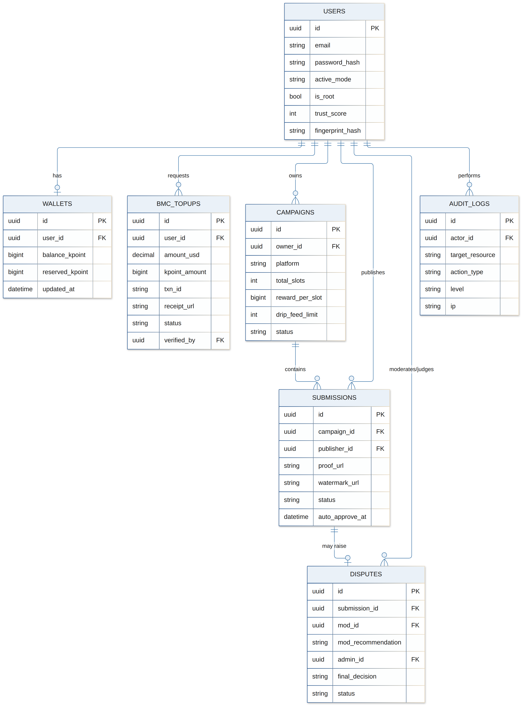

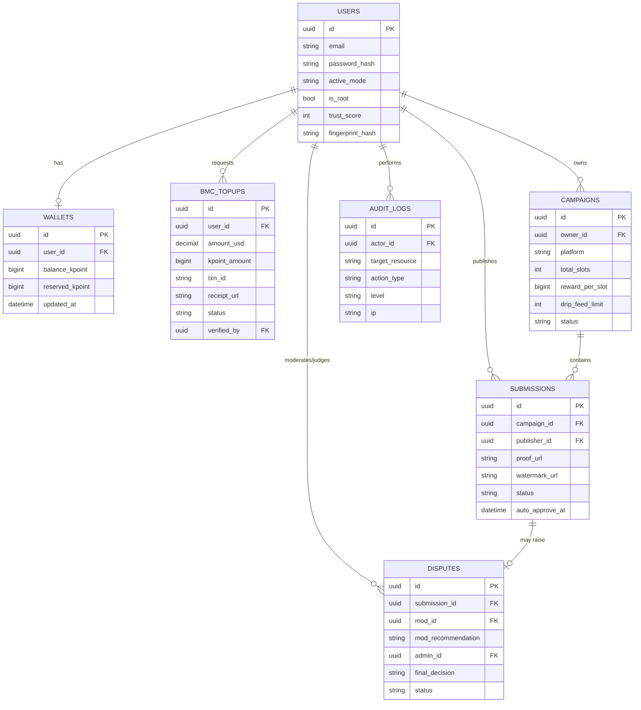

| Tên Bảng (Table) | Các Trường Cốt lõi (Key Fields) | Khóa ngoại & Khóa chính (PK/FK) |
|---|---|---|
| `users` | id, email, password_hash, active_mode, is_root, trust_score, fingerprint_hash | PK: id |
| `roles_permissions` | id, role_name, permission_code | PK: id |
| `wallets` | id, user_id, balance_kpoint, reserved_kpoint, updated_at | PK: id, FK: user_id → users.id |
| `bmc_topups` | id, user_id, amount_usd, kpoint_amount, txn_id, receipt_url, status, verified_by | PK: id, FK: user_id, verified_by → users.id |
| `campaigns` | id, owner_id, platform, total_slots, reward_per_slot, drip_feed_limit, status | PK: id, FK: owner_id → users.id |
| `submissions` | id, campaign_id, publisher_id, proof_url, watermark_url, status, auto_approve_at | PK: id, FK: campaign_id, publisher_id |
| `disputes` | id, submission_id, mod_id, mod_recommendation, admin_id, final_decision, status | PK: id, FK: submission_id, mod_id, admin_id |
| `audit_logs` | id, actor_id, target_resource, action_type, level, payload_before, payload_after, ip | PK: id, FK: actor_id → users.id |

---

## VIII. User Flows (Luồng nghiệp vụ người dùng)

> Phần bổ sung mới trong Document Edition v1.0, minh họa trải nghiệm đầu-cuối (end-to-end) của từng actor dựa trên các đặc tả Section I–VII.

### 8.1. Luồng Bên A — Advertiser

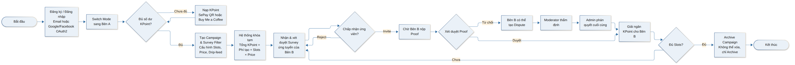

```mermaid
flowchart LR
    S([Bắt đầu]) --> L[Đăng ký / Đăng nhập<br/>Email hoặc Google/Facebook OAuth2]
    L --> SW[Switch Mode sang Bên A]
    SW --> TOP{Đủ số dư KPoint?}
    TOP -- Chưa đủ --> PAY[Nạp KPoint<br/>SePay QR hoặc Buy Me a Coffee]
    PAY --> TOP
    TOP -- Đủ --> CR[Tạo Campaign & Survey Filter<br/>Cấu hình Slots, Price, Drip-feed]
    CR --> LOCK[Hệ thống khóa tạm<br/>Tổng KPoint = Phí tạo + Slots × Price]
    LOCK --> REV[Nhận & xét duyệt Survey ứng tuyển của Bên B]
    REV --> INV{Chấp nhận ứng viên?}
    INV -- Reject --> REV
    INV -- Invite --> WAIT[Chờ Bên B nộp Proof]
    WAIT --> CHK{Xét duyệt Proof}
    CHK -- Từ chối --> DISP[Bên B có thể tạo Dispute]
    CHK -- Duyệt --> PAYOUT[Giải ngân KPoint cho Bên B]
    DISP --> MODR[Moderator thẩm định]
    MODR --> ADMD[Admin phán quyết cuối cùng]
    ADMD --> PAYOUT
    PAYOUT --> DONE{Đủ Slots?}
    DONE -- Chưa --> REV
    DONE -- Đủ --> ARCHIVE[Archive Campaign<br/>Không thể xóa, chỉ Archive]
    ARCHIVE --> E([Kết thúc])
```

### 8.2. Luồng Bên B — Publisher

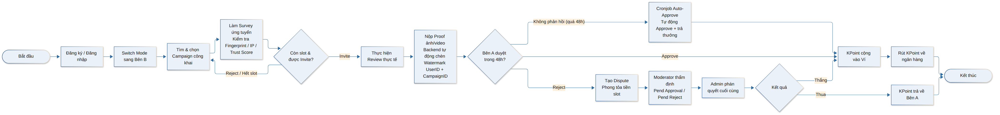

```mermaid
flowchart LR
    S([Bắt đầu]) --> L[Đăng ký / Đăng nhập]
    L --> SW[Switch Mode sang Bên B]
    SW --> BROWSE[Tìm & chọn Campaign công khai]
    BROWSE --> SURV[Làm Survey ứng tuyển<br/>Kiểm tra Fingerprint / IP / Trust Score]
    SURV --> SLOT{Còn slot & được Invite?}
    SLOT -- Reject / Hết slot --> BROWSE
    SLOT -- Invite --> TASK[Thực hiện Review thực tế]
    TASK --> PROOF[Nộp Proof ảnh/video<br/>Backend tự động chèn Watermark UserID + CampaignID]
    PROOF --> WAITA{Bên A duyệt trong 48h?}
    WAITA -- "Không phản hồi (quá 48h)" --> AUTO[Cronjob Auto-Approve<br/>Tự động Approve + trả thưởng]
    WAITA -- Approve --> PAYOUT[KPoint cộng vào Ví]
    WAITA -- Reject --> DISP[Tạo Dispute<br/>Phong tỏa tiền slot]
    AUTO --> PAYOUT
    DISP --> MODR[Moderator thẩm định<br/>Pend Approval / Pend Reject]
    MODR --> ADMD[Admin phán quyết cuối cùng]
    ADMD --> RESULT{Kết quả}
    RESULT -- Thắng --> PAYOUT
    RESULT -- Thua --> LOSE[KPoint trả về Bên A]
    PAYOUT --> WD[Rút KPoint về ngân hàng]
    WD --> E([Kết thúc])
    LOSE --> E
```

### 8.3. Luồng Nạp KPoint (SePay & Buy Me a Coffee)

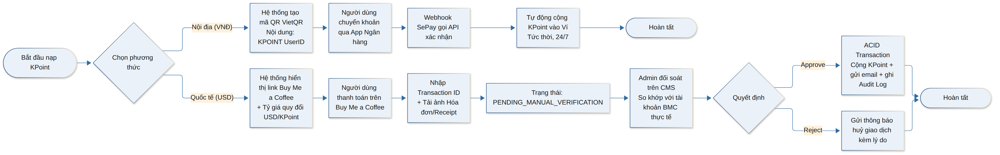

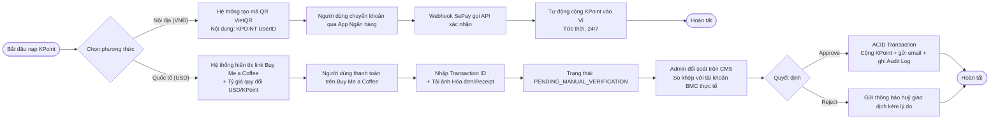

### 8.4. Luồng Xử lý Khiếu nại (Dispute)

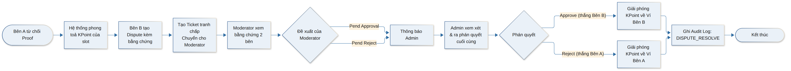

```mermaid
flowchart LR
    S([Bên A từ chối Proof]) --> LOCK[Hệ thống phong toả KPoint của slot]
    LOCK --> CREATE[Bên B tạo Dispute kèm bằng chứng]
    CREATE --> TICKET[Tạo Ticket tranh chấp<br/>Chuyển cho Moderator]
    TICKET --> REVIEW[Moderator xem bằng chứng 2 bên]
    REVIEW --> REC{Đề xuất của Moderator}
    REC -- Pend Approval --> NOTIFY1[Thông báo Admin]
    REC -- Pend Reject --> NOTIFY1
    NOTIFY1 --> FINAL[Admin xem xét & ra phán quyết cuối cùng]
    FINAL --> OUT{Phán quyết}
    OUT -- "Approve (thắng Bên B)" --> RB[Giải phóng KPoint về Ví Bên B]
    OUT -- "Reject (thắng Bên A)" --> RA[Giải phóng KPoint về Ví Bên A]
    RB --> LOG[Ghi Audit Log: DISPUTE_RESOLVE]
    RA --> LOG
    LOG --> E([Kết thúc])
```

---

## IX. Sequence Diagrams (Luồng xử lý kỹ thuật)

> Phần bổ sung mới trong Document Edition v1.0, mô tả tương tác giữa Frontend, Backend API, các dịch vụ bên thứ ba (SePay, Buy Me a Coffee) và cơ sở dữ liệu cho từng chức năng tại Section V.

### 9.1. Switch Role Mode

Tương ứng FN-AUTH-01.

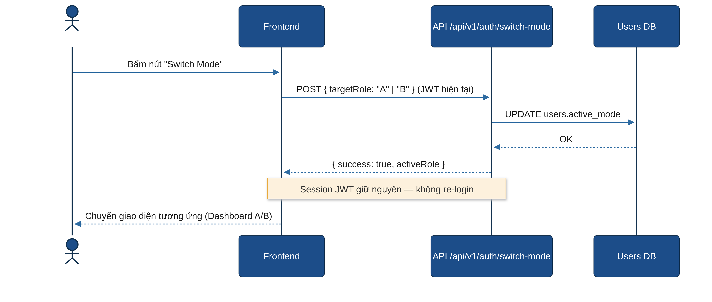

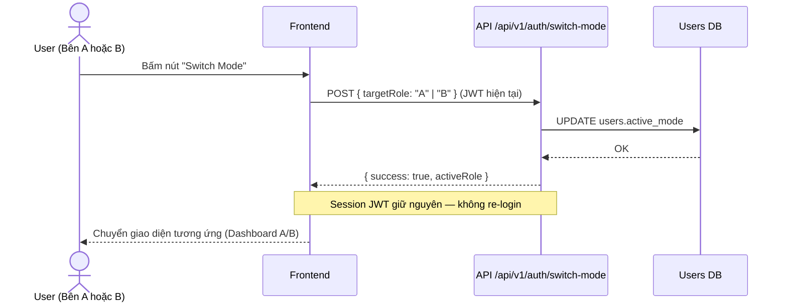

### 9.2. Nạp SePay tự động

Tương ứng FN-PAY-01.

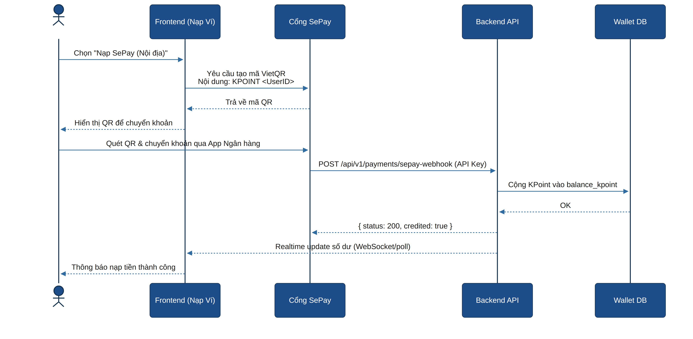

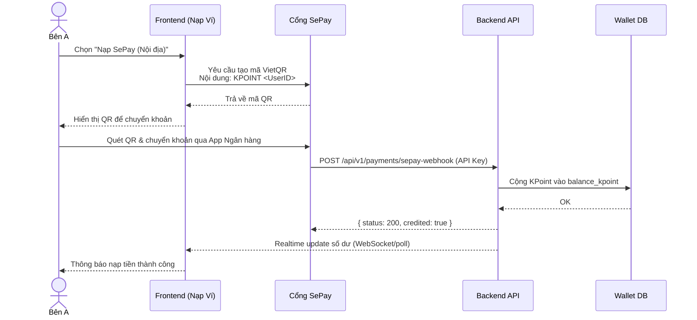

### 9.3. Nạp & Duyệt Buy Me a Coffee

Tương ứng FN-PAY-02, FN-PAY-03.

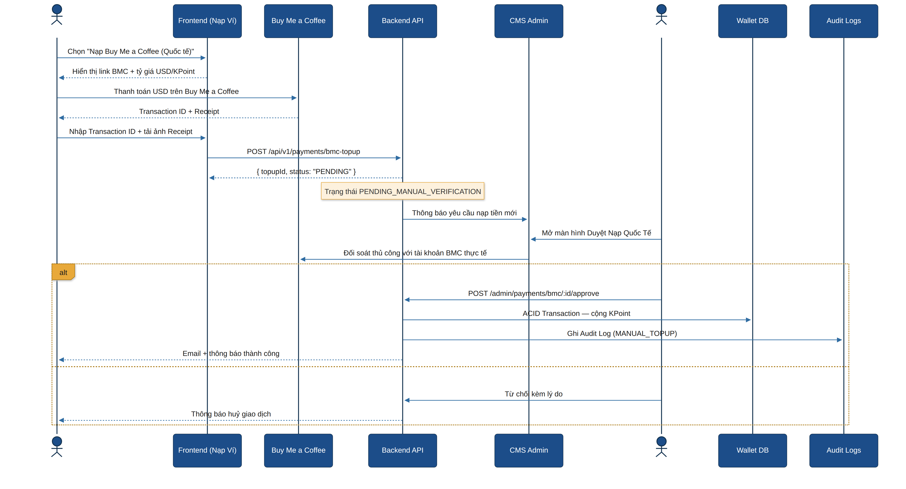

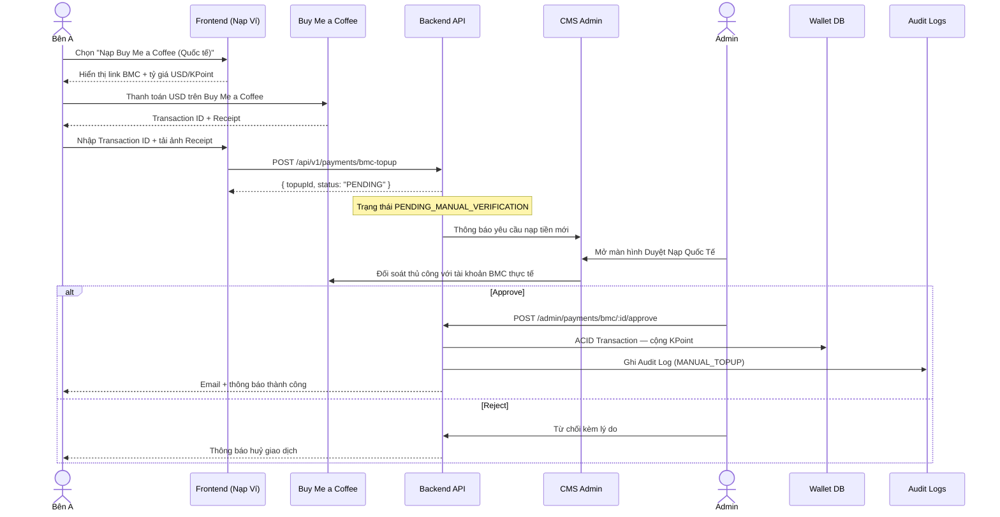

### 9.4. Khởi tạo Campaign

Tương ứng FN-CAMP-01.

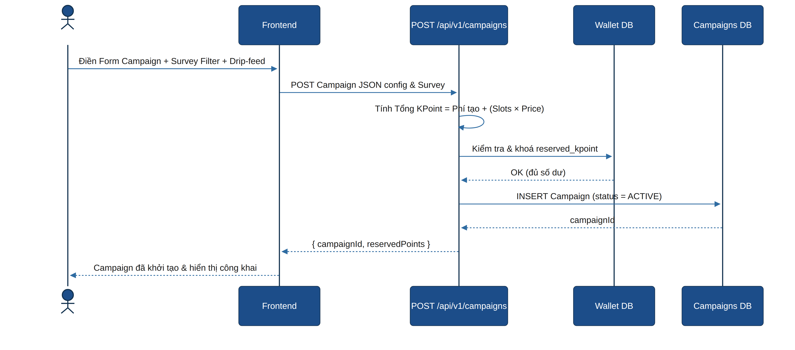

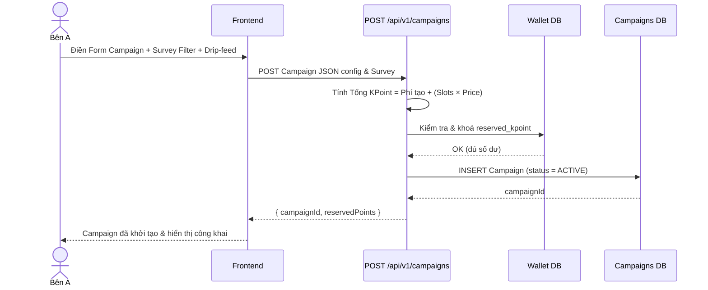

### 9.5. Nộp Proof & Auto-Approve 48h

Tương ứng FN-CAMP-02, FN-TASK-01, FN-TASK-02.

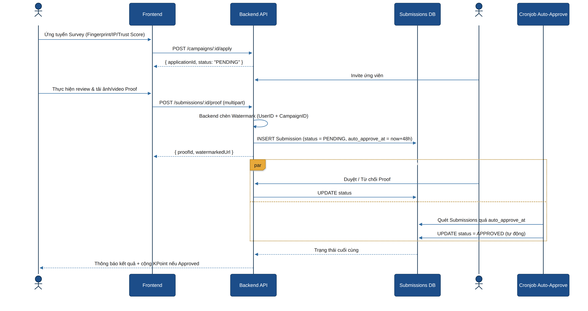

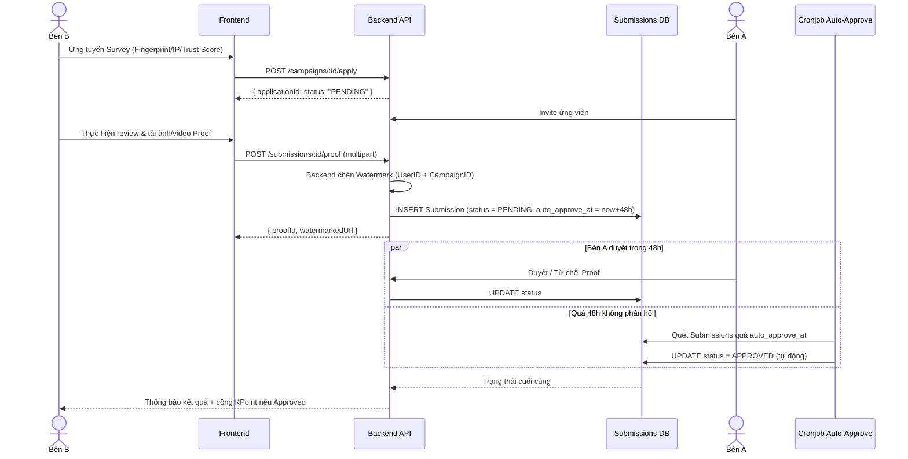

### 9.6. Vòng đời Dispute

Tương ứng FN-DISP-01, FN-DISP-02, FN-DISP-03.

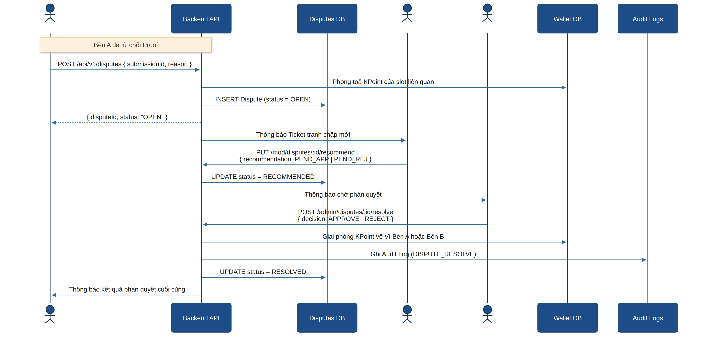

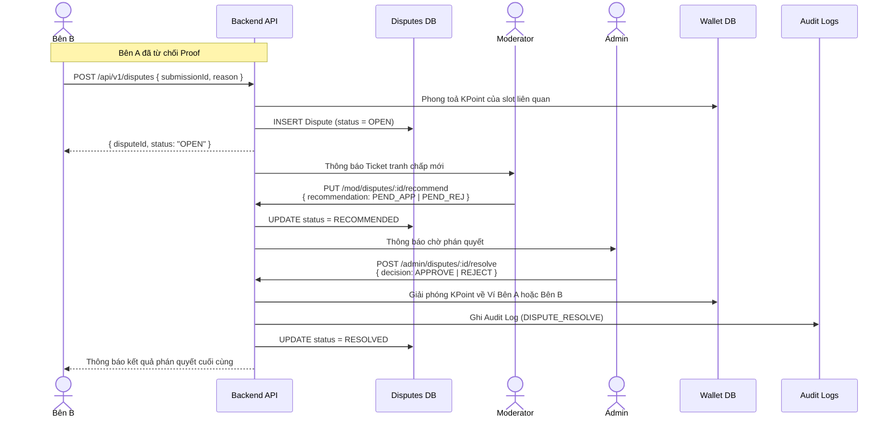

---

© 2026 K-Point Platform — Tài liệu nội bộ, bảo mật theo chính sách công ty.

